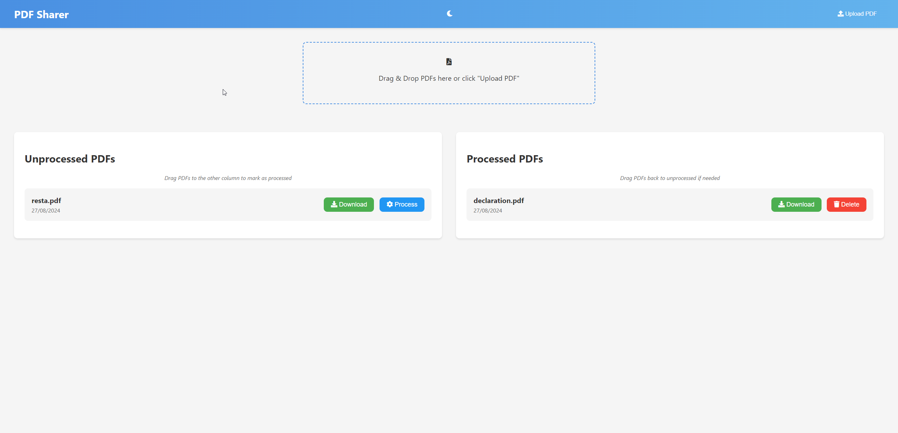

## Interface



# PDF Sharer App

PDF Sharer is an open-source web application that allows users to upload, manage, and share PDF files by giving access to the app. It provides a simple and intuitive interface for organizing PDFs into processed and unprocessed categories.

## Features

- Upload PDF files
- Drag-and-drop functionality for file uploads and PDF management
- Categorize PDFs as processed or unprocessed
- Download PDFs
- Delete PDFs
- RESTful API for PDF management

## Tech Stack

- Backend: Flask (Python)
- Frontend: HTML, CSS, JavaScript
- Database: SQLite (default), compatible with other SQL databases
- ORM: SQLAlchemy
- Migrations: Alembic
- Containerization: Docker

## Prerequisites

- Docker and Docker Compose

## Quick Start

```bash
# Clone and enter directory
git clone https://github.com/michalito/pdf-sharer.git
cd pdf-sharer

# Development (with hot-reload)
./deploy.sh dev

# Production
./deploy.sh prod
```

The application will be available at `http://localhost:5001`.

> **Note:** Port 5001 is used by default to avoid conflict with macOS AirPlay Receiver on port 5000.

## Installation and Setup

All operations use Docker via the `deploy.sh` script.

### Development Environment

1. Clone the repository:
   ```bash
   git clone https://github.com/michalito/pdf-sharer.git
   cd pdf-sharer
   ```

2. Start the development server:
   ```bash
   ./deploy.sh dev
   ```

The application will be available at `http://localhost:5001` with hot-reload enabled (code changes auto-reload).

#### Development Commands

```bash
./deploy.sh dev              # Start development containers
./deploy.sh dev down         # Stop development containers
./deploy.sh dev restart      # Restart containers
./deploy.sh logs             # View logs (follow mode)
./deploy.sh migrate          # Apply pending migrations
./deploy.sh migrate create "Add new table"  # Create new migration
```

### Production Environment

1. Start the application:
   ```bash
   ./deploy.sh prod
   ```
   This will:
   - Create `.env` from `.env.example` if needed
   - Auto-generate `SECRET_KEY` if not set
   - Build the Docker image
   - Start the container
   - Run database migrations automatically
   - Wait for health check to pass

2. Manage the deployment:
   ```bash
   ./deploy.sh status          # Check container health
   ./deploy.sh logs            # View logs (follow mode)
   ./deploy.sh logs 100        # View last 100 lines
   ./deploy.sh prod restart    # Restart containers
   ./deploy.sh prod down       # Stop containers
   ./deploy.sh rebuild         # Rebuild from scratch
   ```

3. Cleanup:
   ```bash
   ./deploy.sh cleanup containers  # Remove containers only
   ./deploy.sh cleanup volumes     # Remove data volumes (careful!)
   ./deploy.sh cleanup all         # Full cleanup
   ```

The application will be available at `http://localhost:5001`. Configure your reverse proxy (e.g., Nginx) to forward requests to this port and handle SSL termination.

### Environment Variables

Configure in `.env` file (auto-generated from `.env.example`):

| Variable | Description | Default |
|----------|-------------|---------|
| `SECRET_KEY` | Session encryption key | Auto-generated |
| `DATABASE_URL` | Database connection string | SQLite at `instance/pdfs.db` |
| `UPLOAD_FOLDER` | PDF storage directory | `uploads/` |
| `MAX_CONTENT_LENGTH` | Max upload size in bytes | 16777216 (16MB) |
| `HOST_PORT` | Docker host port | 5001 |

## API Documentation

The PDF Sharer App provides a RESTful API for PDF management:

| Method | Endpoint | Description |
|--------|----------|-------------|
| `GET` | `/api/pdfs` | List all PDFs (optional `?status=processed\|unprocessed`) |
| `POST` | `/api/pdfs` | Upload a new PDF (multipart/form-data, field: `file`) |
| `GET` | `/api/pdfs/<id>` | Download a specific PDF |
| `PATCH` | `/api/pdfs/<id>` | Update PDF status (JSON: `{"status": "processed"}`) |
| `DELETE` | `/api/pdfs/<id>` | Delete a specific PDF |

For detailed API usage, refer to `app/api/routes.py`.

## Contributing

We welcome contributions to the PDF Sharer App! Please follow these steps to contribute:

1. Fork the repository
2. Create a new branch for your feature or bug fix
3. Make your changes and commit them with clear, descriptive messages
4. Push your changes to your fork
5. Submit a pull request to the main repository

Please ensure your code adheres to the project's coding standards and include tests for new features.

## License

This project is licensed under the MIT License. See the [LICENSE](LICENSE) file for details.

## Security Considerations

- Ensure that the `SECRET_KEY` is kept secret and unique for each deployment
- Regularly update dependencies to patch any security vulnerabilities
- Implement proper input validation and sanitization to prevent security issues
- Use HTTPS in production to encrypt data in transit
- Regularly backup the database and uploaded files

## Support

If you encounter any issues or have questions, please file an issue on the GitHub repository.


## Appendix

### Project Structure

```
pdf-sharer/
├── app/
│   ├── __init__.py          # Application factory
│   ├── config.py            # Configuration management
│   ├── exceptions.py        # Custom exceptions
│   ├── api/                  # REST API layer
│   │   └── routes.py
│   ├── web/                  # Web page serving
│   │   └── routes.py
│   ├── services/             # Business logic
│   │   └── pdf_service.py
│   ├── repositories/         # Data access
│   │   └── pdf_repository.py
│   ├── domain/               # Models
│   │   └── models.py
│   └── static/
│       ├── css/
│       ├── js/
│       └── templates/
├── migrations/               # Alembic migrations
├── deploy.sh                 # Deployment script
├── entrypoint.sh             # Docker entrypoint
├── Dockerfile
├── docker-compose.yaml       # Production config
├── docker-compose.dev.yaml   # Development config (hot-reload)
├── requirements.txt
└── run.py                    # Application entry point
```

### API Usage Example

Upload a PDF using JavaScript:

```javascript
const formData = new FormData();
formData.append('file', pdfFile);  // pdfFile is a File object

fetch('/api/pdfs', {
  method: 'POST',
  body: formData
})
.then(response => response.json())
.then(data => console.log(data))
.catch(error => console.error('Error:', error));
```